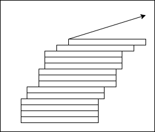

    

# Leaning Tower of Pizza presents 

Architectural Kata 2022 submission for Diversity Cyber Council

# Table of Contents

## Solution Presentation

1. Intro (this readme)
2. Our design process and design attributes
    - Design considerations
    - What we did and (explicitly) did not design
3. How to read this documentation
    - Domain and subdomain views
    - Solution diagrams and legend
4. Diversity Cyber Council Domain Areas
5. Framework of solutions
5. Solution Design by domain
    - Nonprofit Community Engagement (Core)
    - Nonprofit Profile and Registration (Supporting)
    - Nonprofit Offerings (Supporting)
    - Offerings and Candidate Match (Core)
    - Candidate Profile (Core)
    - Mentoring (Core)
    - Candidate Career Progression (Core)
    - Analytics and Reporting (Supporting)
    - End User Landing Pages and UX experience (Supporting)
    - Meeting and Event Scheduling (Generic)
    - Login, Aunthentication and Authorization (Generic)
    - Email and Notifications (Generic)
    - Public API and outgoing integrations (Generic)

    
## Supporting documentation
1. Architecture decision log
2. Complete diagram
    
------------------

# Design process and design attributes

The staus of Diversity Cyber Council as a nonprofit organisation provides some unique constraints that we feel are important to be reflected in the design. 

## Primary design attributes

### Modularity (feature self-containment)
As a nonprofit organisation, Diversity Cyber Council might not have access to the same resources as commercial organisations all the times. When building the Spotlight platform, it might be more beneficial to divide the work between multiple groups. Similarly as the platform evolves, features will be added, modified or phased out. By having the system designed so that each domain is self contained, each team can be smaller and easier to deliver. This also allows the platform as a whole to be more flexible, and minimise the amount of needed when adding or evolving features.

### Total cost of ownership
As nonprofit have to be mindful of costs, the designed should minimise ongoing operations costs that would be a long running expense for the organisation. This includes both computation and licensing costs, as well as any staff needed to maintain it. Once built, the platform should be as efficient as possible.

## Secondary design attributes

### Stability
Diversity Cyber Council operates on trust of communities, and this could easily be lost if the platform is not available

### Data Driven
As one of the problems are decentralisation and lack of visibility of nonprofit oranisations, we must ensure we capture all possible interactions to be able to address the gaps.

# What is and what is not designed

## What we have focused on

- The functional split of services, and defining responsibilities of each one
- Defining and describing interactions between services 
- Identifying and describing non-funtional and supporting services needed to deliver capabilities
- Describing the technology of the solution
- Identifying the minimal data needed for platform to function, and desiging platform to supporting adding data fields in the future

## What we have not done

- Narrow solutions down to particular language, library, framework or hosting unless strongly dictated by the requirements. We feel that in general cases most implementations would be interchangeable, and strongly dependant on people who would be available. If some fuctionality would be best to provide by 3rd party products, we aimed to provide matching alternatives to choose from. We did our best to pick up 3rd parties who have free or nonprofit plans
- Identifying all possible data that could be useful, as this is dependent on particular use cases

